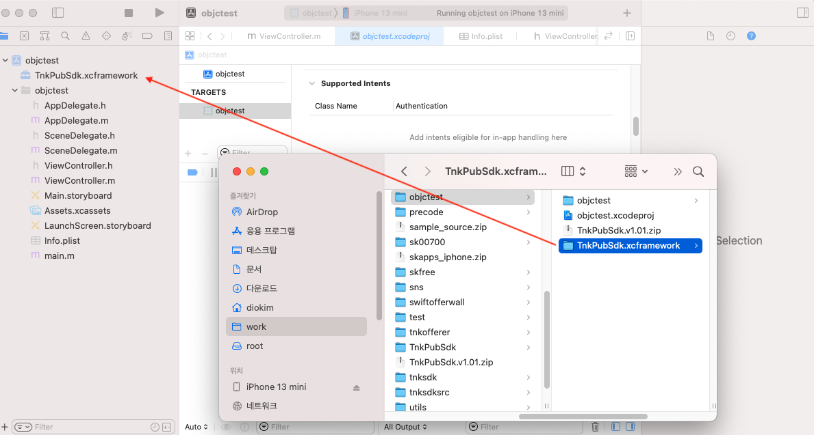
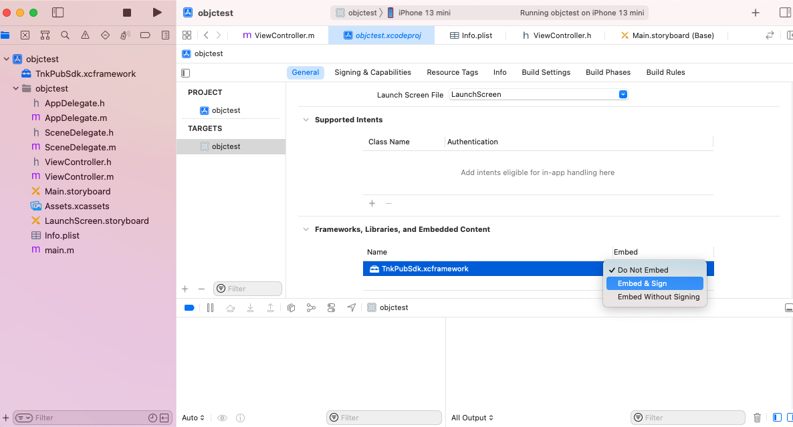
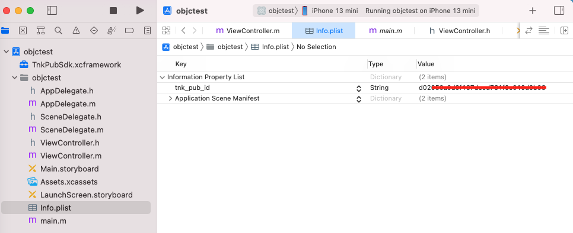

# Tnk Publisher SDK (for iOS)

## 목차

1. [SDK 설정하기](#1-sdk-설정하기)
   * [Test Flight](#test-flight)
   * [Publisher ID 등록하기](#publisher-id-등록하기)
   * [COPPA 설정](#coppa-설정)
2. [전면 광고 (Interstitial Ad)](#2-전면-광고-interstitial-ad)
   * [전면 광고 객체 생성](#전면-광고-객체-생성)
   * [전면 광고 띄우기](#전면-광고-띄우기)
     * [광고 로드 후 바로 노출](#광고-로드-후-바로-노출)
     * [광고 로드 후 일정시간 후에 노출](#광고-로드-후-일정시간-후에-노출)
     * [액티비티 변경 후 노출](#액티비티-변경-후-노출)
   * [종료 시 전면 광고 사용 방법](#종료-시-전면-광고-사용-방법)
   * [전면 광고 관리를 위한 클래스 AdManager](#전면-광고-관리를-위한-클래스-admanager)
     * [전면 광고 로드](#전면-광고-로드)
     * [전면 광고 노출](#전면-광고-노출)
     * [AdManager를 사용하면 전면 광고 로드와 동시에 노출이 가능](#admanager를-사용하면-전면-광고-로드와-동시에-노출이-가능)
3. [배너 광고 (Banner Ad)](#3-배너-광고-banner-ad)
   * [XML 뷰 삽입 방식](#xml-뷰-삽입-방식)
     * [배너 뷰 생성](#배너-뷰-생성)
     * [배너 광고 로드](#배너-광고-로드)
   * [뷰 동적 생성 방식](#뷰-동적-생성-방식)
     * [부모 레이아웃 생성](#부모-레이아웃-생성)
     * [배너 광고 로드](#배너-광고-로드-1)
4. [피드형 광고 (Feed Ad)](#4-피드형-광고-feed-ad)
   * [XML 뷰 삽입 방식](#xml-뷰-삽입-방식-1)
     * [피드 뷰 생성](#피드-뷰-생성)
     * [피드 광고 로드](#피드-광고-로드)
   * [뷰 동적 생성 방식](#뷰-동적-생성-방식-1)
     * [부모 레이아웃 생성](#부모-레이아웃-생성-1)
     * [피드 광고 로드](#피드-광고-로드-1)
5. [네이티브 광고 (Native Ad)](#5-네이티브-광고-native-ad)
   * [레이아웃 생성](#레이아웃-생성)
   * [네이티브 객체 생성](#네이티브-객체-생성)
   * [네이티브 광고 띄우기](#네이티브-광고-띄우기)
     * [광고 로드 후 바로 노출](#광고-로드-후-바로-노출-1)
     * [광고 로드 후 일정시간 후에 노출](#광고-로드-후-일정시간-후에-노출-1)
6. [동영상 광고 (Video Ad)](#6-동영상-광고-video-ad)
   * [리워드 동영상 광고 적립 여부 확인](#리워드-동영상-광고-적립-여부-확인)
7. [AdListener 사용 방법](#7-adlistener-사용-방법)
8. [미디에이션 (Mediation)](#8-미디에이션-mediation)
   * [맞춤 이벤트 추가 예시](#맞춤-이벤트-추가-예시)

## 1. SDK 설정하기

### SDK 다운로드

### 프레임워크 등록

다운로드받은 SDK 압축파일을 풀면 TnkPubSDK.xcframework 폴더가 생성됩니다.
해당 폴더를 적용하고자 하는 XCode 프로젝트 폴더로 이동시키세요.

폴더를 이동시켰으면 TnkPubSDK.xcframework 폴더를 XCode 내에 마우스로 드래그합니다.
이후 XCode -> Target -> General -> Frameworks, Libraries, and Embedded Content 항목에 TnkPubSdk.xcframework 가 있는 것을 확인하시고 Embed 설정을 Embed & Sign 으로 변경합니다.

아래의 이미지를 참고하세요.




### Test Flight

아래의 코드를 사용하어 간단하게 테스트 광고를 띄워보세요.

> 전면 광고 (Interstitial Ad)
#### Swift
```swift
// ViewController.swift

import UIKit
import TnkPubSdk

class ViewController: UIViewController, TnkAdListener {

    @IBOutlet var adbutton:UIButton!
    
    @IBAction func didButtonClicked() {
        //TnkUtils.showATTPopup(viewController: self)
        
        let adItem = TnkInterstitialAdItem(viewController: self,
                                              placementId: "TEST_INTERSTITIAL_V")
        adItem.setListener(self)
        adItem.load()
    }
    
    func onLoad(adItem:TnkAdItem) {
        adItem.show()
    }
```
#### Objectvie-C
```objective-C
// ViewController.h

#import <UIKit/UIKit.h>
#import <TnkPubSdk/TnkPubSdk.h>

@interface ViewController : UIViewController <TnkAdListener>

@property (nonatomic, weak) IBOutlet UIButton *adButton;

- (IBAction)adButtonPressed:(id)sender;
@end

// ViewController.m

- (IBAction)adButtonPressed:(id)sender {
    TnkInterstitialAdItem* adItem = [[TnkInterstitialAdItem alloc]
                                        initWithViewController:self
                                        placementId:@"TEST_INTERSTITIAL_V"];
    [adItem setListener:self];
    
    [adItem load];
}

- (void)onLoad:(id<TnkAdItem>)adItem {
    [adItem show];
}
```
> 배너 광고 (Banner Ad)


> Test Flight 용 Placement 들

아래와 같이 광고 유형별로 Test Flight 용 Placement 들을 제공하고 있습니다. 아래의 Placement ID 를 사용하시면 별도로 계정이나 앱을 등록하지 않아도 간단하게 테스트 광고를 띄워보실 수 있습니다.

- TEST_BANNER_100 : 배너 광고 (640x100)
- TEST_BANNER_200 : 배너 광고 (640x200)
- TEST_INTERSTITIAL_H : 전면 광고 가로
- TEST_INTERSTITIAL_V : 전면 광고 세로
- TEST_INTERSTITIAL_V_FINISH : 전면 광고 세로 (종료시 2-Button 형)
- TEST_FEED : 피드형 광고
- TEST_NATIVE : 네이티브 광고
- TEST_REWARD_V : 리워드 동영상 광고

### Publisher ID 등록하기

Test Flight 에서는 별도로 계정등록을 하지않아도 간단히 테스트를 진행할 수 있었습니다. 하지만 실제 광고를 받기 위해서는 우선 Tnk Publish Site 에서 Inventory를 등록하여 발급받은 ID 를 info.plist 파일에 tnk_pub_id 항목으로 추가하셔야합니다.
아래의 샘플을 참고하시어 실제 ID 를 등록하세요.



실제 ID 를 등록하면 위 Test Flight 코드에서는 더 이상 광고가 나타나지 않습니다. Tnk Publish Site 에서 광고 유형에 맞추어 Placement 를 등록하시고 등록한 Placement의 이름을 사용하셔야 실제 광고가 표시됩니다.

**(Test Flight의 PLACEMENT_ID를 사용하여 테스트를 진행하기 위해서는 Publisher ID를 등록하지 않고 진행 하셔야합니다.)**

### COPPA 설정

COPPA는 [미국 어린이 온라인 개인정보 보호법](https://www.ftc.gov/tips-advice/business-center/privacy-and-security/children's-privacy) 및 관련 법규입니다. 구글 에서는 앱이 13세 미만의 아동을 대상으로 서비스한다면 관련 법률을 준수하도록 하고 있습니다. 연령에 맞는 광고가 보일 수 있도록 아래의 옵션을 설정하시기 바랍니다.

#### Swift
```Swift
    TnkAdConfiguration.setCOPPA(true)  // ON - 13세 미안 아동을 대상으로 한 서비스 일경우 사용
    TnkAdConfiguration.setCOPPA(false) // 기본값
```
#### Objective-C
```Objective-C
    [TnkAdConfiguration setCOPPA:YES]; // ON - 13세 미안 아동을 대상으로 한 서비스 일경우 사용
    [TnkAdConfiguration setCOPPA:NO];  // 기본값
```


## 2. 전면 광고 (Interstitial Ad)

### 전면 광고 객체 생성

#### Swift

프레임워크를 import 하시고 아래와 같이 Placement ID 를 입력하여 전면 광고 객체를 생성합니다.

```Swift
import UIKit
import TnkPubSdk
...

    override func viewDidLoad() {
        super.viewDidLoad()
        // Do any additional setup after loading the view.
        
        let adItem = TnkInterstitialAdItem(viewController: self,
                                              placementId: "YOUR-PLACEMENT-ID")
    }
}
```
#### Objective-C

프레임워크 Header 파일(TnkPubSdk.h) 을 import 하시고 아래와 같이 Placement ID 를 입력하여 전면 광고 객체를 생성합니다.

```java
#import <UIKit/UIKit.h>
#import <TnkPubSdk/TnkPubSdk.h>

...

- (void)viewDidLoad {
    [super viewDidLoad];
    // Do any additional setup after loading the view.
    
    TnkInterstitialAdItem* adItem = [[TnkInterstitialAdItem alloc]
                                        initWithViewController:self
                                        placementId:@"YOUR-PLACEMENT-ID"];
    
}
```

### 전면 광고 띄우기

#### 광고 로드 후 바로 노출

전면 광고가 로드되는 시점에 바로 광고를 띄우려면 AdListener 를 사용합니다.

```Swift
import UIKit
import TnkPubSdk

class ViewController: UIViewController, TnkAdListener {

    override func viewDidLoad() {
        super.viewDidLoad()
        // Do any additional setup after loading the view.
        
        let adItem = TnkInterstitialAdItem(viewController: self,
                                              placementId: "YOUR-PLACEMENT-ID")
        
        adItem.setListener(self)
        adItem.load()
    }
    
    func onLoad(_ adItem:TnkAdItem) {
        adItem.show()
    }
    

}
```

```Objective-C
// ViewController.h
#import <UIKit/UIKit.h>
#import <TnkPubSdk/TnkPubSdk.h>

@interface ViewController : UIViewController <TnkAdListener>
@end

// ViewController.m
#import "ViewController.h"

@interface ViewController ()

@end

@implementation ViewController

- (void)viewDidLoad {
    [super viewDidLoad];
    // Do any additional setup after loading the view.
    
    TnkInterstitialAdItem* adItem = [[TnkInterstitialAdItem alloc]
                                        initWithViewController:self
                                        placementId:@"YOUR-PLACEMENT-ID"];
    [adItem setListener:self];
    [adItem load];
}

- (void)onLoad:(id<TnkAdItem>)adItem {
    [adItem show];
}

@end
```
#### 광고 로드 후 일정시간 후에 노출

만약 광고를 로드하고 일정시간 후에 광고를 띄우시려면 아래와 같이 광고가 성공적으로 로딩되었는지 확인한 후 광고를 띄우실 수 있습니다.

```Swift
// 전면 광고 객체 생성
let adItem = TnkInterstitialAdItem(viewController: self, placementId: "YOUR-PLACEMENT-ID")
// 전면 광고 로드
adItem.load();

...

// 일정시간 후에 광고가 로드 되었는지 확인 후 show 호출
// load와 show를 동시 호출하면 광고 미로드 상태로 전면 광고가 노출되지 않습니다.
if (adItem.isLoaded()) {
    adItem.show();
}
```

### 종료 시 전면 광고 사용 방법

'2-Button' 프레임을 사용하여 앱 종료 시 전면 팝업 광고를 자연스럽게 삽입 가능합니다.
(주의: iOS 에서는 강제적으로 앱 종료기능을 제공하지 않습니다. exit(1) 등의 기능을 사용하여 앱 종료기능을 구현할 수 있으나 이로 인한 결과는 개발자가 확인하셔야합니다.)

우선 Publisher Site 에서 해당 Placement의 프레임을 2-Button 프레임으로 설정하시고, 앱에서 종료버튼 클릭시 처리내용을 AdListener의 onClose() 에서 아래의 내용을 참고하여 구현하시면 됩니다.

```Swift
import UIKit
import TnkPubSdk

class ViewController: UIViewController, TnkAdListener {

    override func viewDidAppear(_ animated: Bool) {
        super.viewDidAppear(animated)
        // Do any additional setup after loading the view.
        
        let adItem = TnkInterstitialAdItem(viewController: self,
                                              placementId: "finish_app_3")
        
        adItem.setListener(self)
        adItem.load()
    }
    
    func onLoad(_ adItem:TnkAdItem) {
        adItem.show()
    }
    
    func onClose(_ adItem:TnkAdItem, type:AdClose) {
        if (type == AdClose.Exit) {
            exit(1)
        }
    }
}
```

## 3. 배너 광고 (Banner Ad)

배너 광고를 사용하기 위해서는 우선 배너 광고를 보여주기위한 View(Container View) 를 생성하신후 해당 View 를 TnkBannerView에 설정해야합니다.

#### 배너 뷰 생성

#### 배너 광고 로드

## 4. 네이티브 광고 (Native Ad)

#### 레이아웃 생성

#### 네이티브 객체 생성

#### 네이티브 광고 띄우기


## 6. 동영상 광고 (Video Ad)

지원 예정입니다.


## 7. AdListener 사용 방법

전면, 배너, 네이티브 등 모든 광고는 setListener()를 통해 AdListener를 등록하여 사용할 수 있습니다.

필요한 메소드만 Override하여 사용하면 됩니다.

```Swift
@objc public enum AdClose : Int {
    case Simple = 0
    case Auto = 1
    case Exit = 2
    
    public func description() -> String {
        switch self {
        case .Simple:
            return "AdClose.Simple"
        case .Auto:
            return "AdClose.Auto"
        case .Exit:
            return "AdClose.Exit"
        default:
            return "AdClose.Unknown"
        }
    }
}

@objc public enum AdError : Int {
    case NoError = 0
    case NoAd = -1
    case NoImage = -2
    case Timeout = -3
    case Cancel = -4
    case ShowBeforeLoad = -5
    case NoAdFrame = -6 // not used yet in iOS
    case DupLoad = -7
    case DupShow = -8
    case NoPlacementId = -24
    case NoScreenOrientation = -25
    case NoTestDevice = -28
    case SystemFailure = -99
    
    public func description() -> String {
        switch self {
        case .NoError:
            return "AdError.NoError"
        case .NoAd:
            return "AdError.NoAd"
        case .NoImage:
            return "AdError.NoImage"
        case .Timeout:
            return "AdError.Timeout"
        case .Cancel:
            return "AdError.Cancel"
        case .ShowBeforeLoad:
            return "AdError.ShowBeforeLoad"
        case .NoAdFrame:
            return "AdError.NoAdFrame"
        case .DupLoad:
            return "AdError.DupLoad"
        case .DupShow:
            return "AdError.DupShow"
        case .NoPlacementId:
            return "AdError.NoPlacementId"
        case .NoScreenOrientation:
            return "AdError.NoScreenOrientation"
        case .NoTestDevice:
            return "AdError.NoTestDevice"
        case .SystemFailure:
            return "AdError.SystemFailure"
        default:
            return "AdError.Unknown"
        }
    }
}

@objc public enum AdVideo : Int {
    case VerifySuccessS2S = 1 // 매체 서버를 통해서 검증됨
    case VerifySuccessSelf = 0 // 매체 서버 URL이 설정되지 않아 Tnk 자체 검증
    case VerifyFailedS2s = -1 // 매체 서버를 통해서 지급불가 판단됨
    case VerifyFailedTimeout = -2 // 매체 서버 호출시 타임아웃 발생
    case VerifyFailedNoData = -3 // 광고 송출 및 노출 이력 데이터가 없음
    case VerifyFailedTest = -4 // 테스트 동영상 광고임
    case VerifyFailedError = -9 // 그외 시스템 에러가 발생
    
    public func description() -> String {
        switch self {
        case .VerifySuccessS2S:
            return "AdVideo.VerifySuccessS2S"
        case .VerifySuccessSelf:
            return "AdVideo.VerifySuccessSelf"
        case .VerifyFailedS2s:
            return "AdVideo.VerifyFailedS2s"
        case .VerifyFailedTimeout:
            return "AdVideo.VerifyFailedTimeout"
        case .VerifyFailedNoData:
            return "AdVideo.VerifyFailedNoData"
        case .VerifyFailedTest:
            return "AdVideo.VerifyFailedTest"
        case .VerifyFailedError:
            return "AdVideo.VerifyFailedError"
        default:
            return "AdVideo.UnknownError"
        }
    }
}

@objc public protocol TnkAdListener {
    
        /**
     * 화면 닫힐 때 호출됨
     * @param adItem 이벤트 대상이되는 AdItem 객체
     * @param type 0:simple close, 1: auto close, 2:exit
     */
    @objc optional func onClose(_ adItem:TnkAdItem, type:AdClose)
    
    /**
     * 광고 클릭시 호출됨
     * 광고 화면은 닫히지 않음
     * @param adItem 이벤트 대상이되는 AdItem 객체
     */
    @objc optional func onClick(_ adItem:TnkAdItem)
    
    /**
     * 광고 화면이 화면이 나타나는 시점에 호출된다.
     * @param adItem 이벤트 대상이되는 AdItem 객체
     */
    @objc optional func onShow(_ adItem:TnkAdItem)
    
    /**
     * 광고 처리중 오류 발생시 호출됨
     * @param adItem 이벤트 대상이되는 AdItem 객체
     * @param error AdError
     */
    @objc optional func onError(_ adItem:TnkAdItem, error:AdError)
    
    /**
     * 광고 load() 후 광고가 도착하면 호출됨
     * @param adItem 이벤트 대상이되는 AdItem 객체
     */
    @objc optional func onLoad(_ adItem:TnkAdItem)
    
    /**
     * 동영상이 포함되어 있는 경우 동영상을 끝까지 시청하는 시점에 호출된다.
     * @param adItem 이벤트 대상이되는 AdItem 객체
     * @param verifyCode 동영상 시청 완료 콜백 결과.
     */
    @objc optional func onVideoCompletion(_ adItem:TnkAdItem, verifyCode:Int)
}
```
